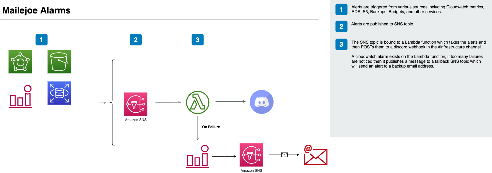

# Mailejoe Infrastructure

Provides the cloudformation templates for setting up Mailejoe from scratch including
creating a new VPC for it to run in.

## Prerequistes

- A domain in Route53 for hosting the application
- An ACM generated certificate for the domain, expecting app.<fqdn>
- SES must be removed from the sandbox via a Support Ticket

## Architecture

#### Alarms

## Deployment

Deployment is scripted via CircleCI to build/upload code as well as validate and execute the
required cloudformation scripts.

### Environment Variables

MAILEJOE_SUPPORT_EMAIL - Email the an alert in the case that alarms going to Discord begin
to fail.
AWS_ACCESS_KEY_ID - AWS access key id for deployment role
AWS_SECRET_ACCESS_KEY - AWS access secret for deployment role
